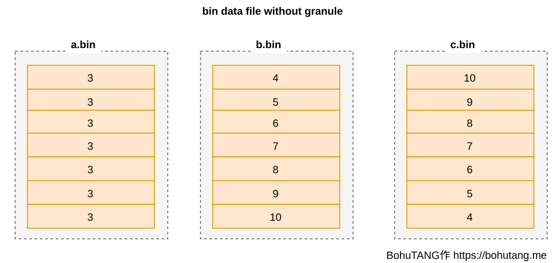
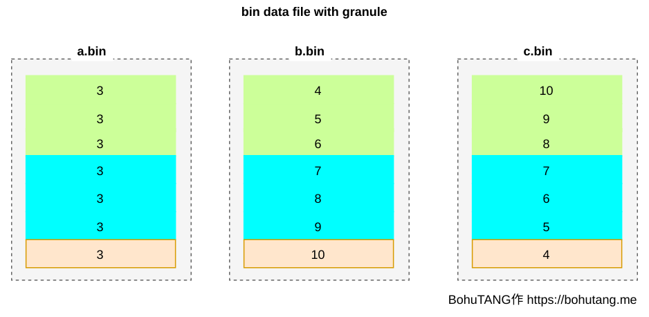
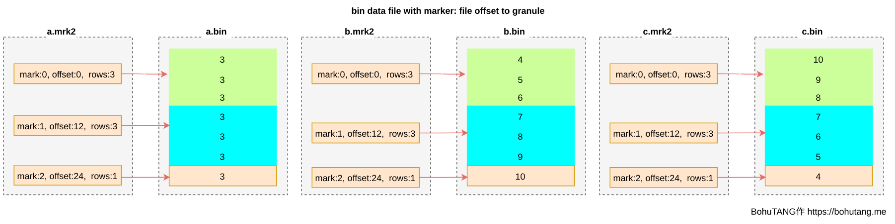
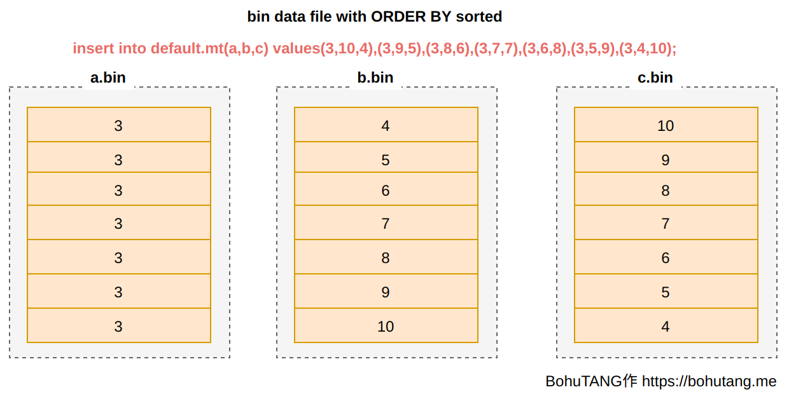
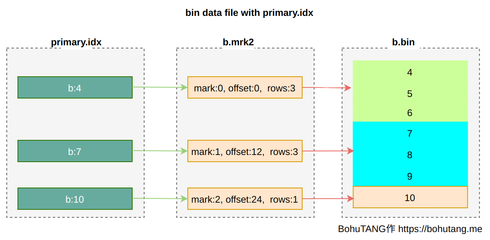
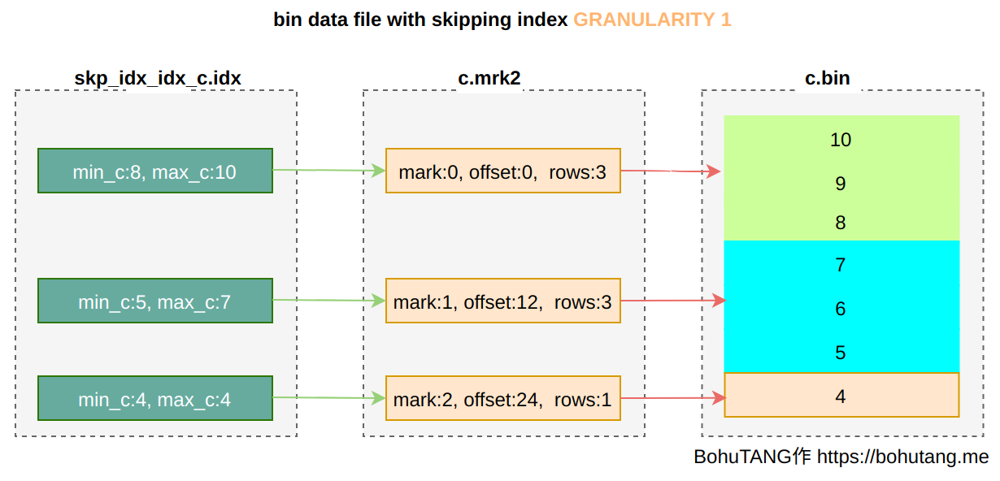
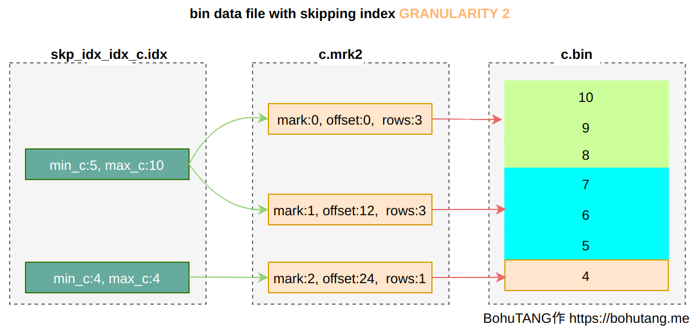
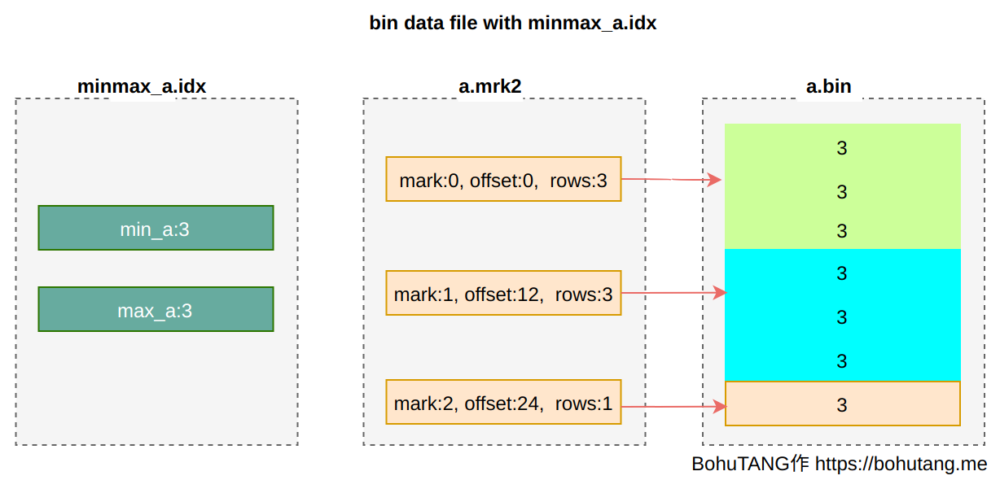

# ClickHouse MergeTree 笔记

本作品采用 [知识共享署名 4.0 国际许可协议](https://creativecommons.org/licenses/by/4.0/) 进行许可

本文基于 [ClickHouse和他的朋友们（6）MergeTree存储结构](https://bohutang.me/2020/06/26/clickhouse-and-friends-merge-tree-disk-layout/) 修改而来，其中样例数据，图片和部分文字来自该文章

## 特点
- 数据按分区(part)管理
    - 每次写入直接产生一个新的分区
    - 不可修改
    - 后台定期合并
- 列存
- 稀疏索引
    - 主键可重复

## 例子
在 learn 这个 database 里创建一个叫 example 的 MergeTree 引擎表
```sql
CREATE TABLE learn.example
(
    `a` Int32,
    `b` Int32,
    `c` Int32,
    INDEX `idx_c` (c) TYPE minmax GRANULARITY 1
)
ENGINE = MergeTree
PARTITION BY a 
ORDER BY b
SETTINGS index_granularity=3
```

写入数据
```sql
INSERT INTO learn.example(a,b,c) VALUES(1,1,1);
INSERT INTO learn.example(a,b,c) VALUES(5,2,2),(5,3,3);
INSERT INTO learn.example(a,b,c) VALUES(3,10,4),(3,9,5),(3,8,6),(3,7,7),(3,6,8),(3,5,9),(3,4,10);
```

## 存储结构
### 目录
```bash
#ls data/learn/example/
1_1_1_0  3_3_3_0  5_2_2_0  detached  format_version.txt
```

数据目录结构
- 为每个 database 和 table 创建一个目录
- 3 次 insert 产生了 3 个数据目录，一个这样的目录就是 ClickHouse 的一个 part (partition ，分区)
- 根据 a 的值（1，3，5）进行分区

### 文件
进入 3 对应的分区，里面包含以下文件
```bash
#ls data/learn/example/3_3_3_0/
a.bin   b.bin   c.bin          c.mrk2       count.txt     partition.dat  skp_idx_idx_c.idx
a.mrk2  b.mrk2  checksums.txt  columns.txt  minmax_a.idx  primary.idx    skp_idx_idx_c.mrk2
```

主要文件
- `*.bin` 列数据文件，按主键排序(ORDER BY)，这里是按照字段 b 进行排序
- `*.mrk2` mark 文件，目的是快速定位 bin 文件数据位置
- `primay.idx` 主键索引文件，目的是加速主键 b 查找
- `minmax_a.idx` 分区键 min-max 索引文件，目的是加速分区键 a 查找
- `skp_idx_idx_c.*` 字段 c 索引文件，目的是加速 c 的查找
- `partition.dat` 当前分区下分区表达式最终生成的值（二进制格式）
- `count.txt` 分区数据总行数
- `checksums.txt` 校验文件
- `columns.txt` 列信息

为什么需要 min-max 索引
- PARTITION BY toYYYYMM(EventTime) ，写入 `2020-05-01` 和 `2020-05-05`
- partition.dat 下会记录 `202005`
- minmax 文件会记录 `2020-05-01` 和 `2020-05-05`

### 分区目录命名规则
```
{partition id}_{min block num}_{max block num}_{level}
```

目录名主要由以下几部分组成
- partition id ，分区 id
- min block num/max block num
    - 从 1 开始
    - 每创建一个新分区则加 1
    - 新分区 min block num 和 max block num 相等
- level
    - 从 0 开始
    - 分区合并后 level 会增加
- 合并产生新分区时
    - 所有分区的最小 min block num 作为新的 min block num
    - 所有分区的最大 max block num 作为新的 max block num
    - 所有分区最大的 level + 1 作为新分区的 level

因此 3 次插入产生了 3 个分区
```
INSERT INTO learn.example(a,b,c) VALUES(1,1,1);
-> 1_1_1_0

INSERT INTO learn.example(a,b,c) VALUES(5,2,2),(5,3,3);
-> 5_2_2_0

INSERT INTO learn.example(a,b,c) VALUES(3,10,4),(3,9,5),(3,8,6),(3,7,7),(3,6,8),(3,5,9),(3,4,10);
-> 3_3_3_0
```


### 分区规则
分区 ID 的生成规则
- 不指定分区键
    - 默认都写到 all 这个分区
- 整型
    - 整型的字符形式
    - 本次的例子 1/5/3
- 日期
    - 日期格式化后的值
    - toYYYYMMDD(xxx)
    - 20210115
- 其他
    - String/Float 等
    - 使用 Hash 值（128 位）
    - 83d743352bffaa6c90c8cbd7b489623a
- 多字段
    - 各个字段生成 ID 后用 `-` 拼接
    - `3-20210115`

### 数据文件
列存
- a.bin 是字段 a 的数据，b.bin 是字段 b 的数据，c.bin 是字段 c 的数据
- 数据按所在行的字段 b 排序
- 所有 bin 的数据按行对应



问题
- 只读取一行也需要加载整个文件

### granularity
ClickHouse MergeTree 把 bin 文件根据颗粒度(GRANULARITY)划分为多个颗粒(granule)

SETTINGS index_granularity=3 表示每 ３ 行数据为一个 granule，分区目前只有 ７ 条数据，所以被划分成 3 个 granule(三个色块)



这样，每次就可以只读取需要的 granule

#### 压缩数据块
bin 文件的 granule 以压缩数据块的形式存储
- 每个压缩数据块的大小控制在 min_compress_block_size (64KB) 和 max_compress_block_size (1MB) 之间
- 对于一个 granule
    - 压缩前大小 < 64KB ，则累积多个 granule 直到大小 > 64KB 后生成一个数据块
    - 压缩前大小 >= 64KB 且 <= 1MB ，直接生成一个数据块
    - 压缩前大小 > 1MB ，按 1MB 截断后分别生成多个数据块

问题
- 如何定位 granule

### 数据标记
为方便读取某个 granule，使用 *.mrk 文件记录每个 granule 的 offset，每个 granule 的 header 里会记录一些元信息，用于读取解析



这样就可以根据 ｍark 文件，直接定位到想要的 granule，然后对这个单独的 granule 进行读取、校验

问题
- 如何知道数据在哪个 granule 或者 mark 中

### 稀疏索引 

数据是有序的


granule 的设计，使得 ClickHouse 天然的适合使用稀疏索引


#### 主键索引
取每个 granule 最小值作为索引值


#### skipping index
普通索引

INDEXidx_c(c) TYPE minmax GRANULARITY 1 针对字段 c 创建一个 minmax 模式索引

GRANULARITY 是指每多少个 granule 建立一行普通索引，GRANULARITY 1 表示每 1 个 granule 建立一行索引



如果定义为 GRANULARITY 2 ，则 2 个 granule 建立一行索引



#### minmax index
针对分区键，MergeTree 还会创建一个 min/max 索引，来加速分区选择



## 查询
### 查询过程
查询的过程其实就是找到数据所在的 granule 的过程（分区裁剪），主要分为 3 步
- 生成查询条件的区间 (Mark Range)
    - WHERE b = 3 => [3, 3]
    - WHERE b > 2 => (2, +inf)
    - WHERE b < 100 => (-inf, 100)
- 递归交集判断，将数据的区间和条件区间递归地做交集判断，从最大的区间 [0, +inf) 开始
    - 不存在交集，则整个区间被优化掉
    - 存在交集，且区间的 granule 数超过 8 ，则将区间进一步拆分为 8 (merge_tree_coarse_index_granularity) 个子区间，对每个子区间重复此规则
    - 存在交集，且区间的 granule 小于 8 ，则记录区间并返回
- 合并区间，只扫描这些区间的数据

另外， ClickHouse 的语法支持了额外的 PreWhere 过滤条件，可以丢弃 granule头尾的一部分行，相当于在 Mark Range 的基础上进一步缩小扫描范围

### 分区键查询
查询
```sql
select * from example where a=3
```

查询会直接根据 a=3 定位到单个分区，这里会利用到 minmax 索引
```
<Debug> executeQuery: select * from example where a=3;
<Debug> InterpreterSelectQuery: MergeTreeWhereOptimizer: condition "a = 3" moved to PREWHERE
<Debug> learn.example (SelectExecutor): Key condition: unknown
<Debug> learn.example (SelectExecutor): MinMax index condition: (column 0 in [3, 3])
<Trace> learn.example (SelectExecutor): Not using primary index on part 3_3_3_0
<Debug> learn.example (SelectExecutor): Selected 1 parts by date, 1 parts by key, 3 marks by primary key, 3 marks to read from 1 ranges

┌─a─┬──b─┬──c─┐
│ 3 │  4 │ 10 │
│ 3 │  5 │  9 │
│ 3 │  6 │  8 │
│ 3 │  7 │  7 │
│ 3 │  8 │  6 │
│ 3 │  9 │  5 │
│ 3 │ 10 │  4 │
└───┴────┴────┘
```

### 主键索引查询
查询
```sql
select * from example where b=5
```

查询会先从 3 个分区读取 prmary.idx，然后定位到只有一个分区符合条件，找到要读取的 mark
```
<Debug> executeQuery: (from 127.0.0.1:39176) select * from example where b=5;
<Debug> learn.example (SelectExecutor): Key condition: (column 0 in [5, 5])
<Debug> learn.example (SelectExecutor): MinMax index condition: unknown
<Trace> learn.example (SelectExecutor): Used optimized inclusion search over index for part 1_1_1_0 with 1 steps
<Trace> learn.example (SelectExecutor): Used optimized inclusion search over index for part 3_3_3_0 with 4 steps
<Trace> learn.example (SelectExecutor): Used optimized inclusion search over index for part 5_2_2_0 with 1 steps
<Debug> learn.example (SelectExecutor): Selected 3 parts by date, 1 parts by key, 1 marks by primary key, 1 marks to read from 1 ranges

┌─a─┬─b─┬─c─┐
│ 3 │ 5 │ 9 │
└───┴───┴───┘
```

### 索引查询
查询
```sql
select * from default.mt where b=5
```

查询会先从 3 个分区读取 prmary.idx 和 skp_idx_idx_c.idx 进行 granule 过滤（没用的 drop 掉），然后定位到只有 3_x_x_x 分区的一个 granule 符合条件
```
<Debug> executeQuery: (from 127.0.0.1:59664) select * from example where c = 5;
<Debug> InterpreterSelectQuery: MergeTreeWhereOptimizer: condition "c = 5" moved to PREWHERE
<Debug> learn.example (SelectExecutor): Key condition: unknown
<Debug> learn.example (SelectExecutor): MinMax index condition: unknown
<Trace> learn.example (SelectExecutor): Not using primary index on part 1_1_1_0
<Debug> learn.example (SelectExecutor): Index `idx_c` has dropped 1 / 1 granules.
<Trace> learn.example (SelectExecutor): Not using primary index on part 3_3_3_0
<Debug> learn.example (SelectExecutor): Index `idx_c` has dropped 2 / 3 granules.
<Trace> learn.example (SelectExecutor): Not using primary index on part 5_2_2_0
<Debug> learn.example (SelectExecutor): Index `idx_c` has dropped 1 / 1 granules.
<Debug> learn.example (SelectExecutor): Selected 3 parts by date, 1 parts by key, 5 marks by primary key, 1 marks to read from 1 ranges

┌─a─┬─b─┬─c─┐
│ 3 │ 9 │ 5 │
└───┴───┴───┘
```

## 缓存
> 数据Cache：MergeTree的查询链路中涉及到的数据有不同级别的缓存设计。主键索引和分区键索引在load Data Part的过程中被加载到内存，Mark文件和列存文件有对应的MarkCache和UncompressedCache，MarkCache直接缓存了Mark文件中的binary内容，而UncompressedCache中缓存的是解压后的Block数据

by 《ClickHouse内核分析-MergeTree的存储结构和查询加速》

## 合并
随着数据的写入，分区会越来越多。而 ClickHouse 通过合并来减少分区的数量

合并时，需要注意
- Partition ID 不同的分区不能合并
- 合并的分区之间必须是相邻，排序规则为 (partition_id, min_block, max_block, level, mutation)

### 合并的触发
合并主要通过以下途径触发
- 后台工作线程自动触发
    - 主要根据后台空闲线程的数量来启发式地决定本次 Merge 最大可以处理的数据量大小
        - max_bytes_to_merge_at_min_space_in_pool 只剩下一个空闲线程时可处理的数据量上限
        - max_bytes_to_merge_at_max_space_in_pool 当空闲线程数最大时可处理的数据量上限
- 用户通过 OPTIMIZE TABLE 手动触发
    - 根据 disk 剩余容量来决定可处理的最大数据量


### 合并策略
- TTL (TTLMergeSelector)
    - 当某个分区中存在数据生命周期超时需要淘汰的数据，并且距离上次使用 TTL 策略达到一定时间间隔（默认1小时）时触发
    - 保证优先合并掉最老的存在过期数据的分区
- Simple (SimpleMergeSelector)
    - 系统默认对合并的区间有一个数量的限制要求（每 5 个才能合并）
        - 写入频繁时，减少低效的两两 merge
    - 如果当前数据分区出现了膨胀，则适量放宽合并数量限制要求（最低可以两两 merge）
        - 减少分区膨胀
    - 如果参与合并的分区中有很久之前写入的分区，也适量放宽合并数量限制要求
        - 保证老分区尽量合并到一个分区
    - 优先选择 IO 开销最小的分区完成合并
        - 尽快合并掉小数据量的分区是对在线查询最有利的方式

### mutation
删除，修改等数据订正操作需要通过 mutation 机制完成
- 后台异步执行
- 将数据读取出来，修改后写到新的目录
- 只能确保 mutation 操作前已经存在的分区都会被订正

# 缺点
merge tree 的特性也决定了其存在以下缺点
- 对小批写不友好
    - 分区太多，不利于查询，合并压力大
    - 分区超过一定阈值会禁止写入
    - 改进: buffer 引擎，引入 wal
- 对更新和删除操作不友好
    - 代价大
    - 实时性不够好

# 思考
- divide and conquer
    - partition
    - granularity
- immutable parts 有很多好处
    - 无需考虑并发修改
    - 易于一些后台工作
    - 易于并行


# 参考
本文也参考和引用了以下资料
- [ClickHouse和他的朋友们（6）MergeTree存储结构](https://bohutang.me/2020/06/26/clickhouse-and-friends-merge-tree-disk-layout/)
- [ClickHouse内核分析-MergeTree的存储结构和查询加速](https://developer.aliyun.com/article/762092)
- [ClickHouse MergeTree变得更像LSM Tree了？——Polymorphic Parts特性浅析](https://blog.csdn.net/nazeniwaresakini/article/details/108596752)
- [clickhouse-release-v20-6-3-28-stable](https://clickhouse.tech/docs/zh/whats-new/changelog/#clickhouse-release-v20-6-3-28-stable)
- [ClickHouse内核分析-MergeTree的Merge和Mutation机制](https://developer.aliyun.com/article/762090)
- [ClickHouse和他的朋友们（10）MergeTree Write-Ahead Log](https://bohutang.me/2020/08/18/clickhouse-and-friends-merge-tree-wal/)
- 《ClickHouse 原理解析与应用实践》 朱凯
