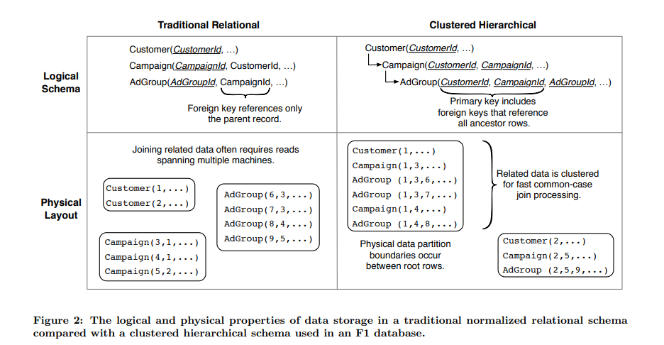
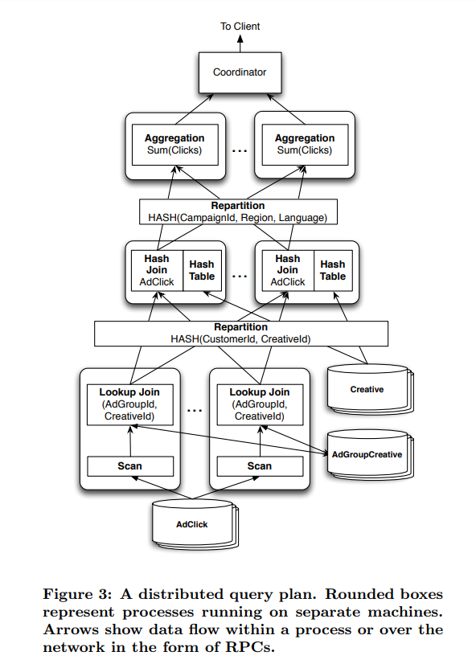

# F1: A Distributed SQL Database That Scales

# INTRODUCTION
F1 是一个具备容灾能力的，全球分布式数据库，兼具 OLTP 和 OLAP 能力，用于替换 Google 的 AdWords 广告系统中分库分表的 MySQL 系统

设计目标
- 可伸缩性 (scalability)，扩容要容易，加机器就行，同时做到业务无感知
- 可用性 (availability)，不管是数据中心宕机了，或者日常维护，修改 schema 等服务都需要保证可用（广告系统是核心业务，不可用会造成资金损失）
- 一致性 (consistency)，提供 ACID 事务，保证数据一致性和正确性
- 易用性 (usability)，提供完整的 SQL 查询支持以及其他用户需要的 SQL 数据库的功能，例如二级索引， ad hoc 查询

F1 在 Spanner 基础上，增加了若干特性
- 支持分布式 SQL 查询，包括和外部数据源做 join 的能力
- 事务一致的二级索引
- 异步 schema 变更
- 乐观事务
- 变更历史自动记录和发布

F1 的一些设计选择会导致常规读写的延迟变高，因此还开发了相关的技术来隐藏延迟，保证最终用户感受到的延时和原来基于 MySQL 的系统差不多
- 通过 F1 表的分级结构以及结构化的列数据类型支持，显式控制数据聚集的方式，提高数据聚集度，减少查询的 rpc 次数
- 重度使用 batching ，并行和异步读取

# BASIC ARCHITECTURE
基本架构如下


各个组件的交互
- 用户通过 F1 client 库和 F1 服务交互，其他工具底下也是基于这个库
- F1 server 负责读写远端数据，协调查询执行
- F1 client 和 load balancer 会优先连接附近 datacenter 的 F1 server
- F1 server 一般和存储该数据的 spanner 服务分布到相同的数据中心里，而 spanner 的数据在 CFS (Colossus File System) 上
    - CFS 和 spanner 不同，不是跨数据中心复制的，因此 spanner 不会和其他数据中心的 CFS 交互
- F1 server 基本上是无状态的
    - 客户端每个请求都可以和不同的 F1 server 交互
    - 只要需要进行悲观事务时，需要持有锁，才需要和一个 F1 server 保持连接直到事务结束
- 当查询发现分布式执行收益更大，则 planner 会选择分布式查询来提高并发度，降低延迟
    - 共享的 slave pool 里的进程可以像常规 F1 server 一样执行分布式查询计划的一个子计划
- 也支持将大规模的数据处理放到 MapReduce 上跑
- 由于数据需要在多个数据中心间做同步复制，因此提交的延时一般比较高，在 50 ~ 150 ms 左右

## Spanner
Spanner 是几乎和 F1 同步开发的底层存储系统，两个团队是紧密协作的

Spanner 提供了类似 directory ，层级化的数据模型。每个目录里的数据会进一步划分成 fragment ，通过 paxos group 做复制。每个 group 可以包含若干个 fragment

Spanner 在多个 paxos group 间支持基于二阶段提交的分布式事务，不过参与组数在 100 个之后中断的频率和延迟会极大增加

Spanner 提供了一个全局的安全时间戳（global safe timestamp），保证没有正在执行或者将来的事务有比他更小的提交时间戳，通常比当前时间落后 5 到 10 秒。基于这个时间戳的读操作可以在任何副本上执行，包括只读副本，而不会阻塞当前正在执行的事务

关于 spanner 可以进一步了解对应的论文

# DATA MODEL
## Hierarchical Schema
F1 的数据模型和 Spanner 的十分相似。实际上，原来 Spanner 的数据模型和 Bigtable 类似，但后来 Spanner 采用了 F1 的数据模型

整个模型是一个树形的结构，父表和子表的行是交织聚集在一起的，子表必须要有一个外键是父表主键的一部分前缀，类似下图的例子



在 root 表中的一行就叫做 root 行，所有属于某个 root 行的子表的行都会和 root 行存到一个 spanner 目录下，这样带来的好处包括
- 相关的数据放到了一起，可以一次 rpc 就全部获取，有利于降低整体的延迟
- 更新 root row 相关的数据往往只需要操作一个目录，避免发起 2PC (二阶段提交)

实际上，这种组织方式并不是强制的，用户也可以采用类似 MySQL 那种组织方式，具体还是要看收益

## Protocol Buffers
F1 列的数据格式支持结构化数据，其实就是作为一个 blob 存储，但是支持使用 protocol buffer 的编码格式
- 方便应用层使用结构化数据，不需要自己实现一套将列数据映射到结构体的代码
- 有 repeated fields 支持，一些需要使用字表管理多条子记录的场景可以改为用 repeated fields 来实现，也可以避免 join 等开销

很多 F1 的表的 schema 可能就包含一个 pb 列

## Indexing
F1 的所有索引都是事务的，一致的，作为一个单独的表存放到 spanner 上，其 key 就是 index 的 key 拼上被索引的表的主键
- index key 可以是标量的列类型，也可以从 pb 列的字段中提取（包括 repeated）字段
- 有两种形式， local 和 global

local index 的 key 必须包含 root row 的主键作为前缀，存储时类似子表，会存到 root row 相同的目录下，它的更新开销很小

global index 不需要用 root row 的主键作为前缀，因此也就不能和要被索引的行分布到一起。对 global index 的更新需要通过 2PC 来实现，因此开销会大很多。索引一次更新太多，涉及到 2PC 的事务参与者也会多很多，效率会变低，也容易出错，因此用得比较少。如果要用，会建议写入方写入数据时，将数据拆成很多个小事务

# SCHEMA CHANGES
F1 的 schema 变更是完全异步化的，要实现这一点挑战是很大的
- F1 是分布式的，节点规模非常大
- 每个 F1 server 内存里会缓存 schema ，很难保证一次全部更新掉
- 变更过程中查询和事务也一直在执行
- 系统可用性和延迟不能受影响

因此， F1 的 schema 变更是异步应用的，逐步地在不同时刻应用到不同的 F1 server 。这意味着两台 F1 server 可能同时使用不同的 schema 更新数据库

这有可能会导致数据不一致或者损坏，例如加索引后，一个机器看到了新的 schema 并插入了数据，同时也写入了索引，而删除的请求却发到了有老的 schema 的服务器，就导致索引表被漏删

为了避免这种情况， F1 实现了以下算法
- 限制所有 F1 server 同时最多只能有两套不同的 schema ，要么使用当前的，要么使用下一个 schema 。为 schema 分配 lease ，lease 过期后就不能有服务器再使用对应的 schema
- 将一次 schema change 分成若干步，每步都保证互相兼容，不会导致异常情况，例如在前面的例子里
    - F1 先增加索引，但限制只能删除，不插入索引数据
    - 随后再升级为可以执行全部写操作
    - 随后启动一个 MapRedcue 任务回写所有行的索引
    - 最后令索引可见，可读

# TRANSACTIONS
F1 基于 spanner 实现了以下三种事务
- Snapshot 事务，使用固定的 snapshot timestamp 执行只读事务（可以 reading repeatable data）。默认会用 global safe timestamp ，落后 5-10 秒。用户也可以自己选择 timestamp 或者让 spanner 选择当前时间戳，但可能会导致延迟更高。 SQL 查询和 MapReduce 默认用这种事务
- 悲观事务，直接映射为 Spanner 的事务，使用有状态的协议，负责处理请求的 F1 server 会持有锁（读也需要），如果这个服务器重启了，事务会中断
- 乐观事务，它包含一个可以任意长的只读阶段，不需要加锁，和一个短的写阶段（Spanner 悲观事务）。F1 在读请求返回的每行数据中都有一个叫 lock 的隐藏列，包含这一行上次修改的时间，每次 commit 会自动设置为 commit timestamp ，在最后的写阶段在客户端里用于校验是否有冲突

F1 客户端默认用乐观事务，因为有以下好处
- 可以容忍行为不正常的客户端，因为读的时候不需要加锁，有些异常客户端可能会跑一个很长的事务
- 支持长周期的事务，也方便 debug ，因为一般悲观事务空闲超过 10s 就会被 kill 掉，以释放锁
- 可以在服务端做重试
- 状态在客户端维护，方便服务端做 failover
- 可以实现 speculative write ，先在外部发起一个乐观事务（例如在 MapReduce 里）读取数据，记录时间戳，随后可以再次用这些值和时间戳发起一次乐观事务，只有在中途没发生过写入时写入才成功

乐观事务也有以下缺点
- 幻写（Inert phantoms），因为新数据是没有 commit timestamp 的，所以可能看到新插入的数据，不过可以通过更粗粒度的锁（parent-table locks）来避免这个问题
- 高冲突时吞吐低

## Flexible Locking Granularity
F1 默认提供行粒度的锁，每行都有一个默认的 lock 列来保护该行的所有列。用户也可以自己定义额外的 lock 列来提高行操作的并发度，减少锁冲突，即一个 lock 列只包含该行的一部分列

同样，用户也可以用父表的列作为锁，来降低并发度，前面提到的幻写问题可以通过这个方式解决

# CHANGE HISTORY
原来 AdWords 在使用 MySQL 时，在应用层的库在每个事务里记录 change history 的。在 F1 里， change history 是首要支持的功能

每个 F1 事务都会创建一个或多个 ChangeBatch pb 对象，包含 primary key 和修改前后的数据。这些记录会写到 root table 下存放 change history 的一张表里。 ChangeBatch 表的主键是对于 root table 的 key 和事务的提交时间戳。如果一个事务更新了多个 root rows ，这些 root row 可能属于不同的 root table ，那么会为每个不同的 root row 写一个 ChangeBatch ，同时里面会包含指向其他行的指针，用于恢复事务

ChangeHistory 可以通过 SQL 查询，由于他和 root table 在同一体系里，因此可以存到同样的目录下，写入时无需额外的参与者

ChangeHistory 的用途有很多，包括用来订阅增量数据，或者实现 snapshot 一致性的 cache

# CLIENT DESIGN
## Simplified ORM
F1 开发了一套新的 ORM 层来替换原来使用 MySQL 时的 ORM 层，不使用 join ，不做隐式的关系遍历，所有的对象加载都是显式的，暴露的 API 易于并行和异步化，这也因为
- F1 支持 pb ，可以减少表的数量
- 采用的层级结构方便一次 range 查询根据主键读取子表的数据，无需 join

新的 ORM 用起来，代码会写得比之前稍微复杂些，但总的来说能让客户端写出更高效的代码，提高 scale 能力

使用新客户端后，最低的延时比之前用 MySQL 高，这个主要受限于读取的耗时比较高，但是平均延时基本相同，而大请求的长尾延时也比平均延时慢几倍而已。而老客户端，大请求的长尾延迟会慢很多，因为代码里会有不少串行的操作

## NoSQL Interface
这不没有太多可讲的，支持类似 NoSQL 的 key/value 接口，实际上 ORM 层是基于这个接口实现的

## SQL Interface
支持 SQL 界面，同时扩展了标准 SQL 以支持访问 pb 数据里的字段

# QUERY PROCESSING
F1 的 sql 查询系统有以下关键特点
- 查询要么进行低延时的集中式执行(centrally execute)，要么进行高并发的分布式执行
- 所有数据都在远端，重度使用 batching 降低网络延时
- 所有的输入和内部数据都是任意分区的，基本没有太多有用的有序特性
- 查询会经过多次 hash 分区步骤
- 每个独立的查询计划都被设计为流式的，会尽快将数据发送给下游，最大化查询流水线
- 对层级化聚集的表有更优的访问方式
- 查询的数据可以并行消费
- 很好地支持 pb 类型列
- Spanner 的 snapshot 一致性模式提供了全局一致的结果

## Central and Distributed Queries
F1 的查询有两种执行模式
- 集中式执行，针对 OLTP 风格的短查询，整个查询在一台 F1 server 上执行
- 分布式执行，针对 OLAP 风格的查询，会分布到 slave pool 的多个 worker 上执行，总是使用 snapshot 事务

查询的优化器启发式地确定使用哪种模式处理查询

## Distributed Query Example
下图给出了一个分布式执行的查询计划例子



对应的 SQL 如下
```sql
SELECT agcr.CampaignId, click.Region,
      cr.Language, SUM(click.Clicks)
FROM AdClick click
  JOIN AdGroupCreative agcr
    USING (AdGroupId, CreativeId)
  JOIN Creative cr
    USING (CustomerId, CreativeId)
WHERE click.Date = '2013-03-23'
GROUP BY agcr.CampaignId, click.Region,
      cr.Language
```

## Remote Data
由于 F1 本身不在本地存储数据，因此处理查询时，特别是做 join 时就会面临很多挑战。 F1 的数据主要在 spanner 上，访问这些数据是碰到的网络延迟是波动很大的。传统的数据库通常在存储对应数据的节点上处理查询，因此它们主要的优化方向是减少磁盘的 seek 和访问

网络延迟和磁盘的延迟很不一样，首先，网络延迟可以通过 batching 和数据访问的流水线化来降低。其次，磁盘的延迟主要是对单一的有限资源，即磁盘资源的竞争导致的。而 F1 的数据通过 Spanner ，再到 CFS ，来分散到大量机器上，最终分散到很多块磁盘上，因此可以通过并行化来获得近似线性的速度提升

batch 的一个例子是做 lookup join 时， F1 会先从 outer table 收集 lookup key ，直到收集的数据达到了 50MB 或者 100K 个不同的 key 再开始一次性 lookup inner table 。lookup 的结果会立即流式输出

F1 的查询算子会尽量流式地处理数据，避免流水线卡顿。这个设计也限制了算子保留数据顺序的能力，尤其是这些算子本身是异步化，并行化地运行的，会尽量地将数据流式地推给后面的算子，因此数据本身的有序性也就丢失了，不过这样可以最大限度地保证查询的并发性，降低行缓存的空间

## Distributed Execution Overview
一个完整的 query plan 包含若干个 plan parts ，每个 plan part 表示一组执行相同 subplan 的 worker 。这些 plan parts 会组织成 DAG 的形式，数据从叶子节点一直流向唯一的 root node ，即根节点。根节点就是接受请求的 F1 server ，也叫 query coordinator ，是整个查询执行的 coordinator ，它负责查询计划，接收查询的结果并执行最终的聚合，排序，过滤并最终将数据流式地返回给客户端

很多分布式数据库会利用数据分配的特点，下推计算给各个分片的节点计算。而 F1 很难利用这个特点，因为 spanner 的分区方式使得数据分布更随机，因此 F1 最终选择只支持 hash partitioning

使用 hash partition 允许 F1 实现高效的分布式 hash join 和聚合算子。 worker 在处理 hash join 时，如果数据量比较大，可以将一部分 hash table 数据写到磁盘中

F1 查询的算子不会将 checkpoint 保存到磁盘上，而是尽可能地将数据流式地发送出去，这可以避免存储中间结果到磁盘的开销，但是这会导致查询涉及的任意一台服务器挂了会让整个查询挂掉。查询挂掉后会做自动重试，通常可以将错误掩盖掉。一般最多执行一个小时的查询都是很稳定的，如果比这个时间长很多的话，就容易碰到很多失败了。目前也在探索不影响正常延时的情况下如何对中间结果做 checkpoint

## Hierarchical Table Joins
F1 的层级结构数据允许用一个请求就执行完下面的 join
```sql
SELECT *
FROM Customer JOIN
     Campaign USING (CustomerId)
```

Spanner 会交织地返回父子表的数据
```rust
Customer(3)
  Campaign(3,5)
  Campaign(3,6)
Customer(4)
  Campaign(4,2)
  Campaign(4,4)
```

读取过程中 F1 会使用一种称为 cluster join 的类似于 merge join 的策略，它只需要每张表缓存一行数据，只要这些表是沿着一条层级路径下降的。因为父层级的表只需要缓存一行就可以和底下所有层级表返回的数据依次完成 join 了

如果需要 join 类似下面相邻的子表，则不能用上面的方法
```
RootTable
  ChildTable1
  ChildTable2
```

它会先用 cluster join 完成父表与其中一张子表的 join，再用其它 join 策略完成剩余部分，比如 lookup join ，因为可以控制 batch 大小，无需回写到磁盘或者花费太多内存。这里为什么不能全部用 cluster join 呢，是因为两张相邻的表之间 join 的时候是要根据 join 的列将行做笛卡尔乘积的，而;可能会有很多行的 join 列值是相同的，如果不把这些行全部缓存下来，是没法完成 join 的，因此也就无法只缓存一行，然后一直和子表返回的数据 join 即可

## Partitioned Consumers
为了避免单点的 query coordinator 或者单个客户端成为数据输出的瓶颈， F1 允许多个 client 分片并行消费查询结果，像 MapRecuce 就有用到这个特性

但因为 F1 的流式处理，其中一个 client 慢了会拖慢其它 client 。一种待实现的优化策略是使用上磁盘作为缓存

## Queries with Protocol Buffers
扩展了 SQL 语法类支持 pb
```sql
SELECT c.CustomerId, c.Info
FROM Customer AS c
WHERE c.Info.country_code = 'US'
```

其中 `c.Info` 是个 pb 列

对于 repeated 字段，通过 PROTO JOIN 语法来支持
```sql
SELECT c.CustomerId, f.feature
FROM Customer AS c
     PROTO JOIN c.Whitelist.feature AS f
WHERE f.status = 'STATUS_ENABLED'
```

其中 `feature` 是一个 repeated 字段， PROTO JOIN 实际上就是将其按照 join 的方式将每个元素分别当做一行和包含列的行 join 起来

对 repeated 字段也支持使用 subquery
```sql
SELECT c.CustomerId, c.Info,
  (SELECT COUNT(*) FROM c.Whitelist.feature) nf
FROM Customer AS c
WHERE EXISTS (SELECT * FROM c.Whitelist.feature f
              WHERE f.status != 'ENABLED')
```

当然， pb 对性能是由损耗的
- 查询时需要从 spanner 读取整个 pb 的数据，而不是部分字段
- 解析 pb 需要开销

未来的一个优化方向是将 pb 的解析和字段提前下推到 spanner ，不过会增大 spanner 的 cpu 开销

# DEPLOYMENT
5 副本部署，因为 3 副本是不够的，只要有任意 1 个副本挂了，或者就是日常维护，就导致剩下 2 个副本必须保证不出问题，否则可用性就会受影响

由于用户的事务通常至少需要 2 次到 leader 的 round trips ，一次读，一次 commit ，除此外 F1 server 也需要和 spanner 做一次额外的读，例如获取 ChangeHistory 的旧值，更新索引，乐观事务的时间戳验证，引用完整性检查等，因此事务在 F1 server ， spanner leader ，客户端都离得近的时候延时更好。 F1 设计了一个 preferred leader location 的特点，尽量让 leader 副本优先分布在一个机房，重数据修改操作的客户端也会部署在该机房。其他一些主要做查询的任务，就可以部署到其他任意地方

# LATENCY AND THROUGHPUT
F1 用户感知到的查询延时通常在 5-10 ms ，提交延时在 50-150ms

对于非交互式的，主要做 bulk update 的应用，则主要优化吞吐，而不是延时。这种会建议应用尽可能拆成小事务，一次尽量只涉及一个目录，同时尽量并行化提高吞吐

F1 的资源使用一般更高，查询使用的 CPU 往往比 MySQL 处理类似查询多一个数量级，这主要是因为 MySQL 不做压缩存储，主要瓶颈在磁盘不在 CPU ，而 F1 要做解压，并且涉及的链路更长，未来的一个方向也是进一步优化 CPU 的使用效率

# 参考
- [fuzhe1989 的博客](https://fuzhe1989.github.io/2020/12/22/f1-a-distributed-sql-database-that-scales/)
