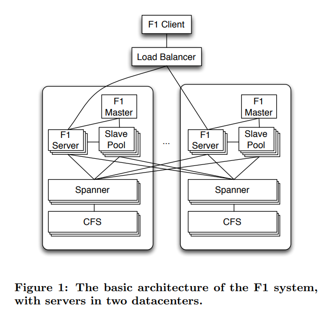

# F1: A Distributed SQL Database That Scales

# INTRODUCTION
F1 是一个具备容灾能力的，全球分布式数据库，兼具 OLTP 和 OLAP 能力，用于替换 Google 的 AdWords 广告系统中分库分表的 MySQL 系统

设计目标
- 可伸缩性 (scalability)，扩容要容易，加机器就行，同时做到业务无感知
- 可用性 (availability)，不管是数据中心宕机了，或者日常维护，修改 schema 等服务都需要保证可用（广告系统是核心业务，不可用会造成资金损失）
- 一致性 (consistency)，提供 ACID 事务，保证数据一致性和正确性
- 易用性 (usability)，提供完整的 SQL 查询支持以及其他用户需要的 SQL 数据库的功能，例如二级索引， ad hoc 查询

F1 在 Spanner 基础上，增加了若干特性
- 支持分布式 SQL 查询，包括和外部数据源做 join 的能力
- 事务一致的二级索引
- 异步 schema 变更
- 乐观事务
- 变更历史自动记录和发布

F1 的一些设计选择会导致常规读写的延迟变高，因此还开发了相关的技术来隐藏延迟，保证最终用户感受到的延时和原来基于 MySQL 的系统差不多
- 通过 F1 表的分级结构以及结构化的列数据类型支持，显式控制数据聚集的方式，提高数据聚集度，减少查询的 rpc 次数
- 重度使用 batching ，并行和异步读取

# BASIC ARCHITECTURE
基本架构如下

各个组件的交互
- 用户通过 F1 client 库和 F1 服务交互，其他工具底下也是基于这个库
- F1 server 负责读写远端数据，协调查询执行
- F1 client 和 load balancer 会优先连接附近 datacenter 的 F1 server
- F1 server 一般和存储该数据的 spanner 服务分布到相同的数据中心里，而 spanner 的数据在 CFS (Colossus File System) 上
    - CFS 和 spanner 不同，不是跨数据中心复制的，因此 spanner 不会和其他数据中心的 CFS 交互
- F1 server 基本上是无状态的
    - 客户端每个请求都可以和不同的 F1 server 交互
    - 只要需要进行悲观事务时，需要持有锁，才需要和一个 F1 server 保持连接直到事务结束
- 当查询发现分布式执行收益更大，则 planner 会选择分布式查询来提高并发度，降低延迟
    - 共享的 slave pool 里的进程可以像常规 F1 server 一样执行分布式查询计划的一个子计划
- 也支持将大规模的数据处理放到 MapReduce 上跑
- 由于数据需要在多个数据中心间做同步复制，因此提交的延时一般比较高，在 50 ~ 150 ms 左右

## Spanner
Spanner 是几乎和 F1 同步开发的底层存储系统，两个团队是紧密协作的

Spanner 提供了类似 directory ，层级化的数据模型。每个目录里的数据会进一步划分成 fragment ，通过 paxos group 做复制。每个 group 可以包含若干个 fragment

Spanner 在多个 paxos group 间支持基于二阶段提交的分布式事务，不过参与组数在 100 个之后中断的频率和延迟会极大增加

Spanner 提供了一个全局的安全时间戳（global safe timestamp），保证没有正在执行或者将来的事务有比他更小的提交时间戳，通常比当前时间落后 5 到 10 秒。基于这个时间戳的读操作可以在任何副本上执行，包括只读副本，而不会阻塞当前正在执行的事务

关于 spanner 可以进一步了解对应的论文

# 参考
- [fuzhe1989 的博客](https://fuzhe1989.github.io/2020/12/22/f1-a-distributed-sql-database-that-scales/)
