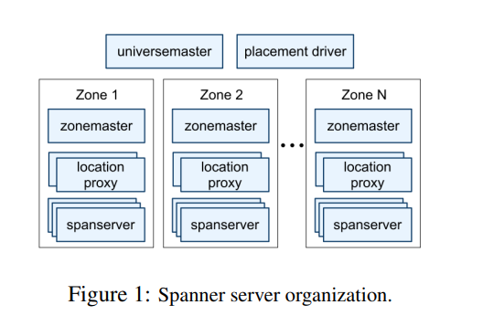
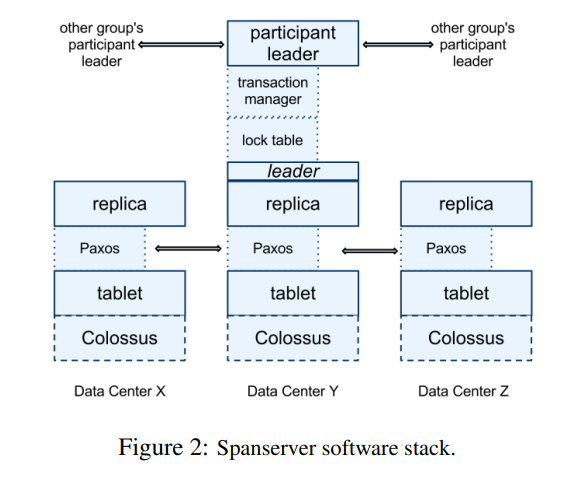
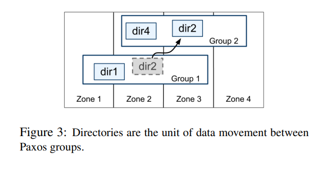
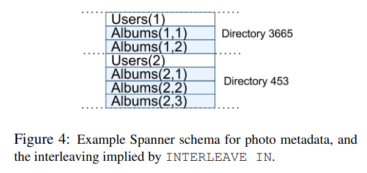
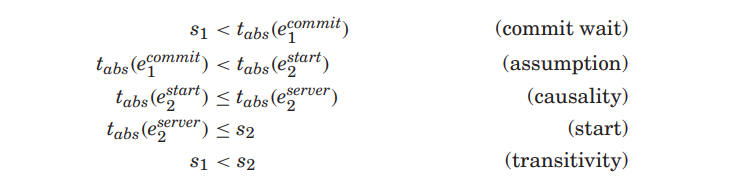
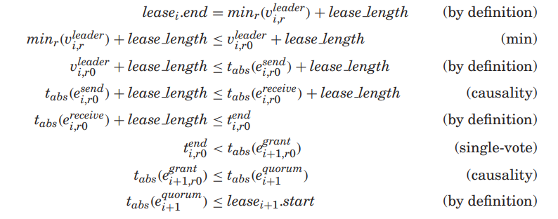

# Spanner: Google's Globally Distributed Database

具体论文见 [google research](https://storage.googleapis.com/pub-tools-public-publication-data/pdf/65b514eda12d025585183a641b5a9e096a3c4be5.pdf)

# INTRODUCTION
Spanner 是一个多版本的数据库
- 数据存储在有 schema 的半关系型表里
- 数据带版本
    - 版本自动设置为提交时的时间戳
- 旧版本的数据通过可配置的垃圾回收策略进行管理
- 应用可以通过时间戳读取到老版本的数据
- 支持事务
- 提供基于 SQL 的查询语言

Spanner 作为全球分布式数据库，还提供了这样的特性
- 灵活的副本配置（可动态修改）
    - 控制数据可以放在哪个数据中心
        - 副本离用户的距离
        - 副本之间的距离
    - 副本的数量
- 还提供了两个一般数据库难以实现的能力
    - 外部读写一致性（externally consistent reads and writes）
    - 同一时间戳下跨数据库的全局一致性读

这里提到这些特性是通过 spanner 为每个事务分配的一个全局提交时间戳实现的，这个时间戳反映了一个串行的顺序：如果一个事务 T1 在事务 T2 开始前提交，则 T1 的提交时间戳小于 T2 的提交时间戳

这个关键能力依靠的就是 TrueTime API 及其实现
- 这个 API 直接保留了时钟的不确定性，而 spanner 时间戳能提供的保证取决于这个 API 的实现能做到什么程度
- 如果不确定性很大， spanner 会慢下来直到不确定性变小
- Google 的集群管理软件提供了一个这个 API 的实现
    - 这个实现依赖多种现代的时钟（GPS 和原子钟）
    - 保证不确定性很小（一般小于 10ms）

# IMPLEMENTATION


部署架构
- 完整部署的一套系统称为一个 universe
- 划分为多个 zone
    - 类似一个数据中心
    - 物理隔离的单元
- 一个 zone 包含一个 zonemaster 成千上百个 spanservers
    - zonemaster 负责分配数据给 spanserver
    - spanserver 实际存储数据，负责给客户端提供数据
    - 另外一个 zone 里还有一些 location proxies 来帮助客户端定位数据在哪个 spanserver
- 一个 universe 有两个单点的服务， universe master 和 placement driver
    - universe master 主要是负责展示所有 zone 的状态信息，用于调试用
    - placement driver 负责定期处理跨 zone 的数据移动
        - 周期在分钟左右
        - 定期和所有 spanserver 通信，找到需要移动的数据
        - 主要用于保证副本数符合要求，以及整体的负载均衡

## Spanserver Software Stack
每个 spanserver 负责管理 100 到 1000 个 tablet ，概念和 bigtable 中的 tablet 类似 ，即一系列 kv 对
```
(key:string, timestamp:int64) -> string
```

不过，和 bigtable 不同的是这个时间戳是 spanner 自己分配的

每个 tablet 其实就是一个 LSM Tree ，其数据存放在 Colossus 里（可以理解为下一代的 GFS）



对于 spanserver 上的每个 tablet ，都会实现一个 paxos 状态机来实现数据复制
- 状态机将元数据和日志存到对应的 tablet 里
- 这个 paxos 实现是 pipelined 的，即实现了 multi-decree parliament
    - 基于租约（10s）的 long-lived leader
    - 允许乱序提交
- 写入需要在 leader 上发起 paxos 协议
- 读操作则可以从任意拥有最新状态的副本上进行
- 这一组副本统称为一个 paxos group

在 leader 副本上面，实现了 lock table 来做并发控制
- 包含两阶段锁的状态
- 记录了 key range 和对应锁状态的映射
- 主要设计来支持长事务（例如分钟级别）
- lock table 是不走状态机复制的，因此是易失的

另外，在 leader 上还实现了一个 trasaction manager
- 用于实现分布式事务
- 可以用于作为 participant leader ，组内其他副本作为 participant slaves
- 对于只涉及一个 paxos group 的事务，无需 trasaction manager 参与
- 对于涉及多个 paxos group 的事务，则这些组之间需要协调以实现二阶段提交
    - 会有其中一个组被选中作为 coordinator
        - 该组的 participant leader 作为 coordinator leader
        - 其他副本作为 coordinator slave
- transaction manager 的状态会通过 paxos group 存储（复制）

## Directories and Placement
在 kv 上，实现了类似 bucket 的抽象，称为 directory （叫这个是历史原因）
- 是一系列有相同前缀的 key 集合



一个 directory 是数据放置（placement）的基本单元
- 在 directory 下的数据有相同的副本配置
- 数据在 paxos group 之间移动时，是按照目录来移动的
- 一个 paxos group 内可以包含多个 directories
    - 可以用来控制数据访问的局部性

在 paxos group 之间移动 directories 是通过 Movedir 这个后台任务实现的
- 也用来实现增删副本的操作
    - 通过将数据移动到有新的副本配置的 group 来实现
    - 因为目前 spanner 的 paxos 实现不支持 paxos 内部的配置更新
- 这个过程不是简单地通过发起一个事务实现的
    - 避免这个事务阻塞前台读写
    - 首先会在后台发起数据迁移
    - 等到数据基本等于全部移动完了，才会最后发起一个事务
        - 将最后一点点数据原子地移动到新的组
        - 并更新两个组的元数据

一个 directory 也是应用可以设置地理分布的最小配置单元
- 设计了一套 placement-specification language
- 可以控制数据有几个副本
- 控制副本在哪个地区

实际上，论文描述做了一定的简化
- directory 过大后，实际上会被分割成多个小的 fragment
- fragment 可以由不同的 paxos group 管理，因此可以分布到不同的服务器上
- Movedir 实际上在组之间移动的是 fragment ，而不是整个目录

## Data Model
Spanner 的数据模型并不是严格的关系型
- 每个表只需要按顺序包含主键列列表里的一个或多个列，不需要包含全部列
- 每个表实际上分别定义了一组主键列到非主键列的映射
- 一行存不存在取决于其 row key 对应的 value 是否存在（即使存的是 null 也相当于存在了）

```
CREATE TABLE Users {
    uid INT64 NOT NULL, email STRING
} PRIMARY KEY (uid), DIRECTORY;

CREATE TABLE Albums {
    uid INT64 NOT NULL, aid INT64 NOT NULL,
    name STRING
} PRIMARY KEY (uid, aid),
  INTERLEAVE IN PARENT Users ON DELETE CASCADE;
```



例如上面的例子， spanner 要求应用将数据分割成一个或多个有层次关系的表
- INTERLEAVE IN 用来定义层次关系
- 最顶层的表就是 directory table
- 对于在 directory table 中主键为 K 的每一行，以及底层的所有表中主键前缀为 K 的数据，组成了一个 directory
- ON DELETE CASCADE 可以控制数据级联删除
- 通过这样的设计，可以让用户控制数据分布的局部性，提高性能
- 例如上面表，就可以有类似图中的两个 directory

# TRUETIME
TrueTime API
- TT.now()
    - 返回 `TTinterval: [earliest, latest]`
- TT.after(t)
    - 如果 t 保证已经过去了，返回 true
- TT.before(t)
    - 如果 t 保证还没到来，返回 true

TT.now() 返回的 TTinterval 保证涵盖了这个函数调用时的绝对时间
- TTinterval 由 TTstamp 类型组成，类似 unix 时间戳
- TT.after() 和 TT.before() 都是 TT.now() 的封装
- TrueTime 保证对于时间 e ，如果其绝对时间为 Tabs(e) ，则对于 tt = TT.now()
    - 必定有 `tt.earliest <= Tabs(e) <= tt.latest`

TrueTime 底下是同时参考两种时钟，分别是基于 GPS 的和原子钟的
- 两种时钟出现不可用的情况各不相同，因此正好可以互补
- GPS 时钟更精确
- 部署
    - 每个数据中心都会部署一系列 time master
    - 每个机器上有一个 timeslave daemon
    - 一部分 time master 运行 GPS 时钟，有专用的天线
    - 剩下一部分（Armageddon masters）有原子钟
    - 所有 master 会相互间进行时间比对，如果发现自己时间偏差过大，就会将自己剔除
- 每个 daemon 会定时轮询多个 masters ，避免只从一个 master 拿时间导致误差
    - 运用 Marzullo 算法的一个变种来检测和拒绝 liar
    - 和其他非 liar 同步时钟
    - 轮询周期 30s
- 误差一般在 1 ~ 7ms ，平均 4ms
- 误差的增大不影响正确性，因为 spanner 会主动等待直到误差变小
    - 不过误差变大得很厉害会让性能会受到影响

# CONCURRENCY CONTROL
这部分有非常多的概念，公式符号（太难打了，这里直接简化了）和推导，有着大量的细节，本人也并没有全部读透，还是建议直接看论文，这里只能摘录其中一小部分。可以说，整个 spanner 的事务模型都是围绕着时间戳来实现的

## Timestamp Management
Spanner 支持
- 读写事务 (read-write transaction)
- 快照事务 (snapshot transaction: predeclared snapshot-isolation transaction)
    - 必须实现声明不包含任何写操作
    - 使用一个系统选择的时间戳，不需要加锁
    - 读操作可以在任何一个足够新的副本上
- 快照读 (snapshot read)
    - 不需要加锁
    - 客户端可以指定读的时间戳，也可以指定一个时间戳的上限，让 spanner 来选择时间戳
    - 同样可以在足够新的副本上执行

### Paxos Leader Leases
Spanner 的 paxos 实现通过基于时间的租约实现了一个长周期的主（leadership），默认周期为 10s。每个候选的主会定期发送 lease vote 请求，然后在接收到多数的 lease vote 后就可以确定自己拥有租约。主会负责在租约过期前及时进行续约

这里定义一个主的 lease interval
- 开始于其发现自己拿到了多数的 lease votes
- 结束于其发现自己没有多数的 lease votes 了（一部分过期了）

这里 spanner 依赖了一个不相交的不变式 (disjointness invariant)，对于每个 paxos group ，组内每个 paxos leader 的租约周期(lease interval)都和组内其他 leader 的不相交

Spanner 的实现允许主通过释放需要做 lease vote 的 slave 来主动退位。定义 smax 为 leader 使用的最大时间戳，在退位前， leader 需要等到 TT.after(smax) 为真

### Assigning Timestamps to RW transaction
读写事务使用两阶段锁，在拿到锁后，可以在任意时间获取时间戳，而 spanner 使用表示事务提交的 paxos 写操作的时间戳作为事务的时间戳

这里 spanner 会依赖一个单调性不变式 (monotonicity invariant) ，在每个 paxos group 内， spanner 为 paxos 写分配的时间戳是单调递增的，即使在跨 leader 的情况下
- 一个 leader 只允许在其 leader lease 内分配时间戳
- 每当一个时间戳 s 被分配了， smax 就会递增至 s ，从而保证不相交性

coordinator leader 对于写事务 Ti 分配的时间戳 si 必须不小于 TT.now().latest ，并且在收到 commit 请求后

coordinator leader 保证客户端在 TT.after(si) 为 true 前看不到任何被 Ti 提交的数据。通过 commit wait 保证 si 小于 Ti 提交的绝对时间



### Serving Reads at a Timestamp
由于单调递增性， spanner 可以正确地判断其副本是否足够新，以满足一个读请求。每个副本都会维护一个称为安全时间 (safe time) 的值 tsafe ，就是副本数据是足够新的 (up-to-date) 的最大时间戳。如果一个读请求的时间戳是 t ，那么一个副本只有在 `t <= tsafe` 时才能满足该读请求的实时性要求

而 tsafe = min(tPaxos safe, tTM safe) ，其中每个 paxos 状态机有一个安全时间 tPaxos safe ，每个 trasaction manager 有一个安全时间 tTM safe
- tPaxos safe 是当前已经应用的 paxos 写操作的时间戳
- tTM safe
    - 在一个副本没有处于 prepared 状态的事务（两阶段提交的中间状态）是无穷大
    - 每个组 g 里的 paraticipant leader 对于事务 Ti 的 prepare 记录会分配一个 prepare timestamp s-prepare-i-g ，而 coordinator leader 需要保证一个事务的提交时间戳 `si >= s-prepare-i-g` 即大于等于所有 participant group 的 prepare 时间戳
    - 因此，对于每个组 g 里的副本，对于所有在该组 prepared 的事务 Ti ，有 `tTM safe = min(s-prepare-i-g) - 1`
        - 我理解这里减 1 是为了避免读到处于 prepare 状态的事务的数据

### Assigning Timestmaps to RO Transactions
Snapshot 事务执行的步骤
- 分配时间戳 sread
- 指定时间戳 sread 做快照读 (snapshot read) 来执行事务的读操作
- 读操作可以在任意足够新的副本上进行

## 细节
### Read-Write Transactions
和 Bigtable 类似，事务写入的数据在提交前，会一直在 client 端 buffer 住
- 这里提到事务中的读是看不到事务写产生的影响 (reads in a transaction do not see the effects of the transaction's write) ，不过这样岂不是看不到自己写的数据，不会用起来不方便？

读写事务中的读操作采用 wround-wait 来避免死锁
- 当客户端完成所有的读操作，并将所有的写操作 buffer 住后，会开始二阶段提交
- 整个二阶段提交的过程是由客户端来驱动的，这样可以避免数据发送两次

每个非 coordinator-participant leader 需要
- 先获取写锁
- 然后选择一个 prepare timestamp
    - prepare timestamp 需要大于所有之前分配给其他事务的时间戳
- 然后写 paxos prepre 记录
- 通知 coordinator leader prepare timestamp

coordinator leader 需要先获取锁，但是会跳过 prepare 阶段。他会在收到所有 participant leader 的 prepare timestamp 为整个事务获取一个时间戳 s
- s 必须大于等于所有 prepare timestamp
- 大于收到 commit message 是的 TT.now().latest
- 大于这个 leader 分配给其他事务的时间戳

在所有 coordinator 副本应用 commit 记录前， coordinator leader 会等待直到 TT.after(s) ,以遵循 commit-wait 的规则
- 在 commit wait 之后， coordinator 会将 commit timestamp 发送给客户端和其他的 participant leader
- participant leader 负责将事务的结果记录到 paxos
- 所有 participant 应用同样的时间戳，然后释放锁

### Snashot Transactions
Spanner 引入一个 scope expression 来描述快照事务需要读的 key (我认为就是描述要读的 key range)
- 如果这个范围落在一个 paxos group 上，则客户端直接向 group leader 发起 snapshot transaction 即可
    - 一般直接用 LastTS() 作为 sread
    - LastTS() 就是这个 paxos group 最后一次 commited write 的时间戳
    - 事务保证看到最后一次写的结果
- 如果涉及多个 paxos group
    - 直接使用 TT.now().latest 作为 sread ，避免在多个副本间基于 LastTS() 协商 sread
    - 发送给足够新的副本

### Schema-Change Transaction
这个操作因为比较重，而 spanner 希望尽量做到 non-blocking ，因此实现成一个特殊的事务
- 分配一个属于未来的时间戳，在 prepare 阶段注册
- 这样 schema change 可以尽量避免阻塞当前的操作
- 而这个时间戳 t 保证所有 schema change 在该时间戳后生效
- 在 t 时间戳之后的读写操作需要阻塞直到 schema-chagne 完成

### Refinement
tTM safe/LastTS() 都可以进一步做到更细的粒度，就是按照 key range 做拆分

tPaxos safe 也可以进一步优化，这里不详细描述

### Paxos Leader-Lease Management
TrueTime 可以用来保证 leader 之间租约的 disjointness

每个潜在的 leader i ，对于副本 r
- 维护从 r 收到的 lease vote 开始时间的下边界为 `v-leader-i-r = TT.now().earliest` ，在 e-send-i-r ，即 leader 发送 lease request 的事件前计算
- 每个副本 r 分配 lease 的时间为 e-grant-i-r ，在收到 lease request 事件 e-receive-i-r 之后
- lease 结束时间为 `t-end-i-r = TT.now().latest + lease_length` ，在 e-receive-i-r 之后计算

每个副本 r ，需要遵守 single-vote 规则，在 TT.after(t-end-i-r) 前不允许分配新的 lease vote

当 leader i 收到多数派的 vote 这个事件 e-quorum-i 后，计算 lease interval 为 `leasei = [TT.now().latest, minr(v-leader-i-r) + lease_length]`
- 在 leader 上，这个租约被认为于 TT.before(minr(v-leader-i-r) + lease_length) 为 false 时过期
- 并且我们由多数派原则可以知道，在 leader i 和 i + 1 之间，肯定有一个公共的副本

因此可以对 disjointness 做证明



# EVALUATION
实验部分没有太多可以说的，这里不做进一步展开，具体可以看论文
